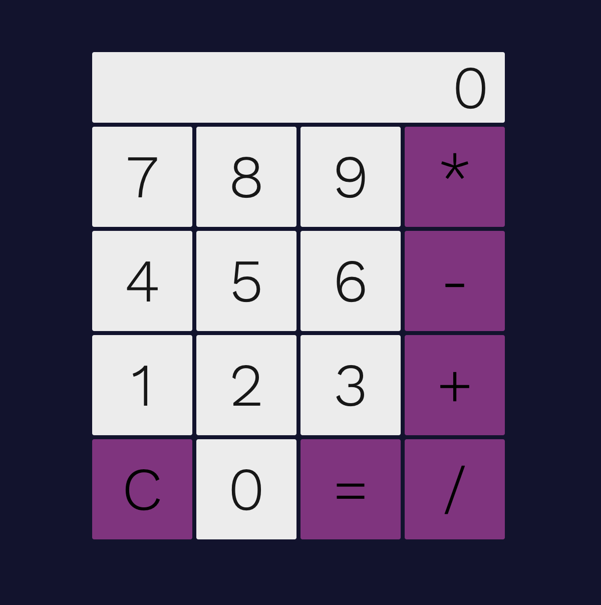

# Overview - the phases of a software project

## 1) Analysis phase

https://en.wikipedia.org/wiki/Requirements_elicitation

Also called requirements gathering phase or discovery phase.
You talk with the customer, with the prospective users etc to
understand:

- What are the problems that you application, sofware, will try to solve
- How it's going to solve them

The output are usually requirements documents.
They usually contain a list of things at a high level that
the sofware will need to address (business requirements, functional requirements).

Usually performed by different roles together:

- Business analysts
- Designers (UX / UI)
- Software developers / architects

### For the calculator

Let's write the requirements. We will use the format of
user stories.

https://en.wikipedia.org/wiki/User_story

- As a user, I want to solve basic math operations, so that I don't have to think in order to get a result
- As a user, I want the result of the previous operation to be preserved, so that I can solve a chain of operations

## 2) UI / UX Design Phase

https://en.wikipedia.org/wiki/User_interface_design

https://en.wikipedia.org/wiki/User_experience_design

UI / UX Designers design the user interface and user experience of the application.

The outputs of this phase are usually:

- Wireframes
- Interactive prototypes
- Mockups

Some tools widely used by designers in this phase:
- https://www.figma.com/ for Mockups
- https://www.uxpin.com/ or https://www.invisionapp.com/ for prototypes/wireframes
- https://miro.com/ to facilitate discussions with customers/users

### Calculator mockup

Here's a mockup of our calculator:

## 3) Software Design Phase

https://en.wikipedia.org/wiki/Software_design

https://en.wikipedia.org/wiki/Software_architecture

Software developers, engineers, architects, designing the architecture of the software.

How to structure the data, how to structure the front-end/back-end,
frameworks to use, etc.

In simple terms: in this phase the developers talk to agree how to code what needs to be coded, so that they are aligned before starting to code.

### Calculator software design

This is an easy application, with a few buttons, no serve, no data to save. We're not gonna focus on this phase, we're gonna start coding :)
